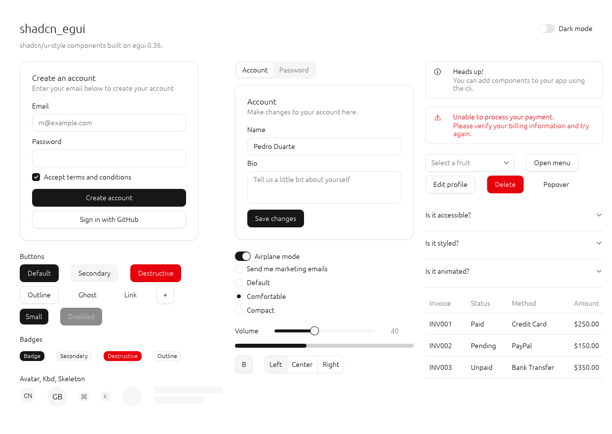
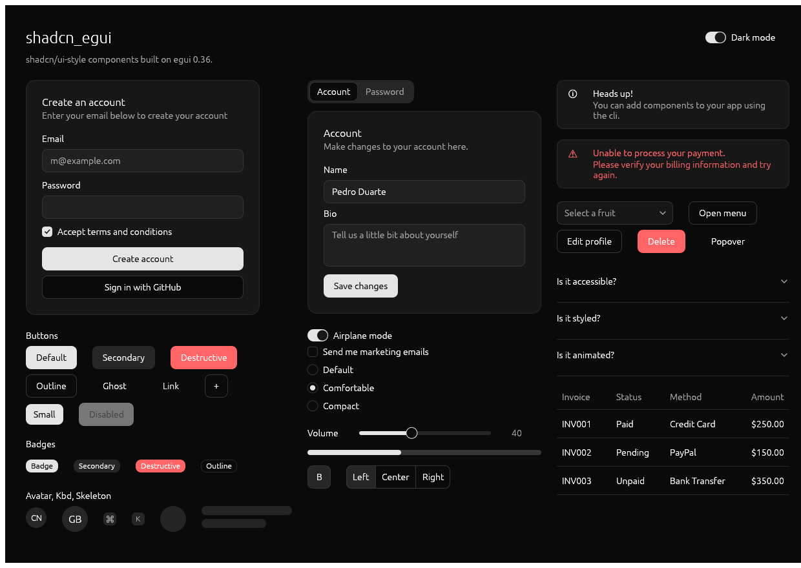

# shadcn_egui

[shadcn/ui](https://ui.shadcn.com)-style components for **egui 0.36**. Colors, radii, sizes and states (hover, focus ring, disabled) follow the shadcn "neutral" palette, with light and dark themes.





## Running

```sh
cargo run --example gallery     # demo gallery on eframe
UPDATE_SNAPSHOTS=1 cargo test   # re-render the screenshots in tests/snapshots/
```

The screenshot tests use `egui_kittest` with wgpu. On a machine without a GPU you need a software Vulkan driver (on Ubuntu: `apt install mesa-vulkan-drivers`).

## Usage

```toml
[dependencies]
egui = "0.36"
shadcn_egui = { git = "https://github.com/georgebigscar-spec/shadcn_egui" }
```

```rust
use shadcn_egui::*;

// once, for example in App::new or before the first frame
Theme::light().install(ctx);   // or Theme::dark()

Card::new()
    .title("Create an account")
    .description("Enter your email below")
    .width(360.0)
    .show(ui, |ui| {
        label(ui, "Email");
        ui.add(Input::new(&mut email).placeholder("m@example.com"));
        ui.add(Checkbox::new(&mut terms).label("Accept terms"));
        if ui.add(Button::new("Create account").full_width()).clicked() {
            toast(ui.ctx(), "Account created", None);
        }
    });

Toaster::show(ctx); // once per frame, if you use toasts
```

`Theme::install` also restyles egui's built-in widgets (windows, scroll bars, selection, TextEdit), so you can mix them freely with the components from this crate.

## Components

| shadcn/ui | shadcn_egui | Notes |
|---|---|---|
| Button | `Button::new / secondary / destructive / outline / ghost / link`, `.size(ButtonSize::Sm/Lg/Icon)`, `.full_width()` | hover, pressed, focus ring, disabled via `ui.add_enabled` |
| Badge | `Badge::new(..).secondary() / destructive() / outline()` | |
| Input | `Input::new(&mut s).placeholder(..).password().invalid(bool).width(..)` | red border and ring when `invalid` |
| Textarea | `Textarea::new(&mut s).rows(n)` | |
| Label | `label(ui, ..)`, `muted(ui, ..)`, `h1/h2/h3` | |
| Checkbox | `Checkbox::new(&mut b).label(..)` | |
| Switch | `Switch::new(&mut b).label(..)` | animated |
| Radio Group | `radio_group(ui, &mut v, &[(val, "Label"), ..])`, `RadioItem` | any `PartialEq` value |
| Slider | `Slider::new(&mut f, 0.0..=100.0).step(1.0)` | dragging and arrow keys |
| Progress | `Progress::new(0.4)` | animates value changes |
| Toggle | `Toggle::new(&mut b, "B").outline()` | |
| Toggle Group | `toggle_group(ui, &mut idx, &["Left", "Center", "Right"])` | single selection |
| Select | `Select::new(&mut Option<usize>, &OPTIONS).placeholder(..)` | popup list with a check mark |
| Dropdown Menu | `dropdown_menu(&trigger, width, \|ui\| { menu_label, menu_item, menu_checkbox, menu_separator })` | shortcuts on the right |
| Popover | `popover(&trigger, width, \|ui\| ..)` | closes on click outside |
| Tooltip | `ui.add(..).tooltip("text")` (`TooltipExt` trait) | dark bubble, as in shadcn |
| Dialog | `Dialog::new(id, "Title").description(..).show(ctx, \|ui\| ..)` + `footer(ui, ..)` | backdrop, ✕ button, Esc, click outside |
| Alert Dialog | `alert_dialog(ctx, id, title, text, "Continue") -> Option<bool>` | |
| Sonner / Toast | `toast(ctx, ..)`, `toast_error(ctx, ..)`, `Toaster::show(ctx)` | stacked bottom-right, dismissed after 4 s |
| Card | `Card::new().title(..).description(..).width(..).show(ui, ..)` | |
| Alert | `Alert::new(..).icon("ℹ").description(..).destructive().show(ui)` | |
| Tabs | `tabs(ui, &mut idx, &["Account", "Password"])` | you draw the content for `idx` |
| Accordion | `Accordion::new(id).item(ui, "Title", \|ui\| ..)` | one open section at a time, animated |
| Table | `Table::new(&headers).widths(..).right_align(&[3]).show(ui, &rows)` | row hover, returns the clicked row |
| Data Table | `DataTable::new(id, vec![Column::new("Email").sortable(), Column::new("Amount").sortable().right()]).filter("Filter...").selection(&mut set).page_size(10).show(ui, &rows)` | sorting (numbers by value), filter across all cells, checkbox column with select-all, Previous/Next pages, `.max_height(px)` scrolls the rows under a fixed header; returns the clicked row |
| Tree | `Tree::new(id).default_open_depth(1).show(ui, &mut selected, \|tree\| { tree.folder(v, "src", \|tree\| ..); tree.leaf(v, "main.rs"); })` | not in shadcn/ui itself, styled like its sidebar file tree; any `PartialEq` value, folder/file icons, guide lines, arrow keys, `.max_height(px)` to scroll |
| Separator | `separator(ui)` | horizontal or vertical depending on layout |
| Avatar | `Avatar::new("CN").image(src).size(40.0)` | initials until the image loads |
| Skeleton | `Skeleton::new([w, h])`, `Skeleton::circle(d)` | pulsing |
| Kbd | `kbd(ui, "⌘")` | |

## Limitations

- egui's default font has no bold weight, so headings are not bold. For an exact look, load Inter or Geist with `ctx.set_fonts` and give headings their own font family.
- Not implemented yet: searchable Combobox, Calendar, Date Picker, Command, Sheet, Navigation Menu, Carousel, Chart, Resizable. For dates there is `egui_extras::DatePickerButton`, for charts the `egui_plot` crate.
- Colors are hex approximations of the shadcn v4 oklch variables; every field of `Theme` can be changed.

## License

MIT, see [LICENSE](LICENSE).
